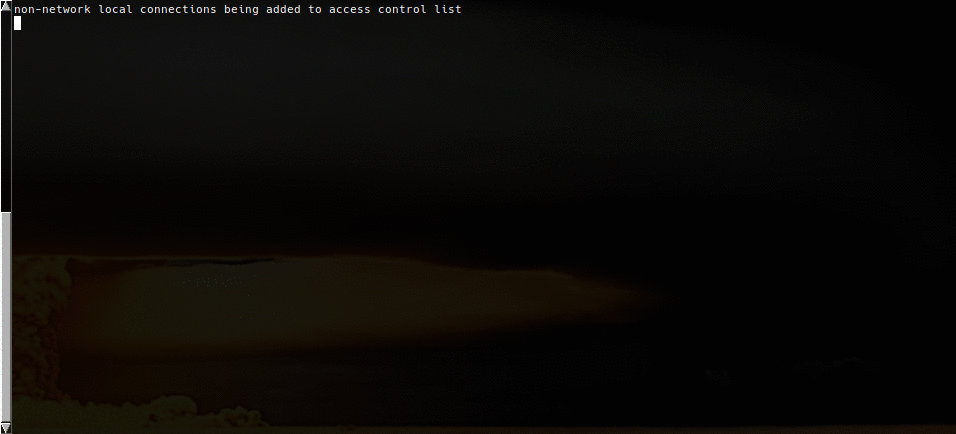

**shellbuddy** is a buttler for shell handling. It will track all used cwds and commands from history and will
put it into a sqlite database with time and prio and provide them to the user via an interactive prompt.

# Installation
## Dependencies
* [promptui]
* [go-toml]
* [go-sqlite3]

[promptui]: https://github.com/manifoldco/promptui
[go-toml]: https://github.com/pelletier/go-toml
[go-sqlite3]: https://github.com/mattn/go-sqlite3

## Building

```sh
go build -o shellbuddy *.go
```

Afterwards you need to copy the binary to a destination that is in your path. A.E.:
```sh
sudo cp shellbuddy /usr/bin/
```

# Usage
## Preparation

For the first run you need to init the configuration files:
```sh
shellbuddy -init
```
This will create a folder unter ~/.shellbuddy with a configuration file.
Edit this file to your needs according the comments.

For the shells you've to include the command to your prompt to update it on a frequent basis.
The easiest way is to source the predefined functions and prompt variables from the included files.

## bash

Add the following line to the end of your .bashrc (with the full path to the file):
```sh
. "shells/bash_include.sh"
```

## zsh

Add the following line to the end of your .bashrc (with the full path to the file):
```sh
. "shells/zsh_include.sh"
```

## Parameters

```sh
Usage of shellbuddy:
  -add
        If you want to add / update an entry
  -cmd
        If you want to add / update commands
  -config string
        Configuration file to use. Defaults to ~/.shellbuddy/config (default "/home/mfulz/.shellbuddy/config")
  -init
        If you want to create a default config file
  -path
        If you want to add / update pathes
  -search string
        Select entries by string
```

## shellbuddy in action


